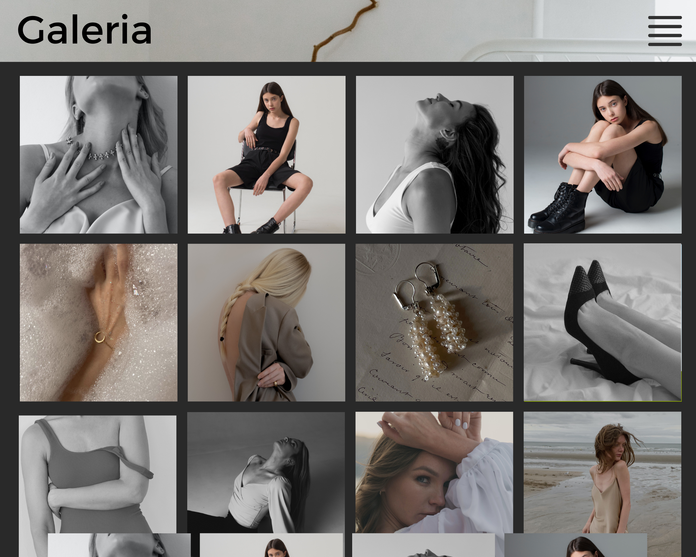

 
<h1>Projeto Galeria</h1>

 

O Projeto **Galeria** é uma aplicação FullStack desenvolvida em JavaScript com Node.js integrado com o banco de dados Mongo DB. Ele oferece uma interface amigavel, exibindo fotos com descrição, data e opção de exclusão. Os usuários também podem adicionar novas fotos diretamente do site, proporcionando uma experiência completa de gerenciamento de galerias de forma prática e intuitiva.

##### [:pencil: Documentação técnica do projeto](documentacao.md)

